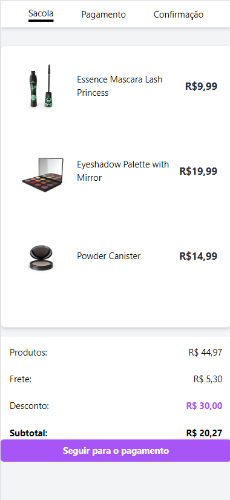
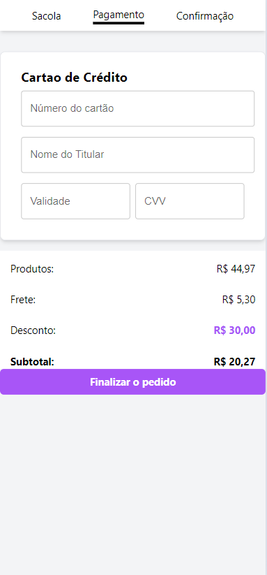
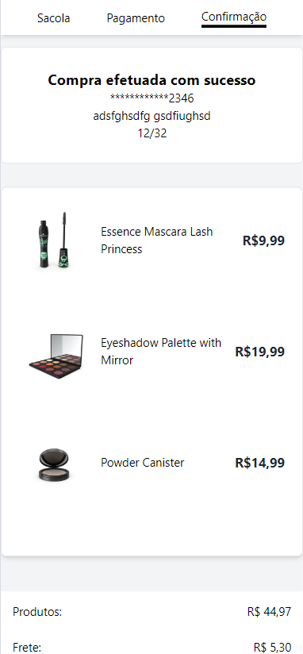

# Tela de Checkout (desafio Front-End Challenges)

## Descrição

Este é um projeto desenvolvido com o objetivo de criar uma aplicação funcional que simula o fluxo de compra em um ecommerce. O desenvolvimento seguiu a abordagem **mobile-first**, garantindo uma experiência otimizada em dispositivos móveis. O desafio consistia em criar as seguintes telas:

1. **Carrinho**: Listar os produtos adicionados, com opção de ajustes na quantidade.

2. **Pagamento**: Permite preencher e validar os dados de pagamento de forma simples e responsiva.

3. **Confirmação do pagamento**: Exibe o resumo do pedido com detalhes da compra.

## 🛠️ Funcionalidades

- **Desenvolvimento Mobile-First**: Garantia de que o design foi otimizado inicialmente para dispositivos móveis, com adaptação para telas maiores.

- **Validação de Formulários**: Implementação eficiente de validações com React Hook Form e Material UI.

- **Gerenciamento de Estado Global**: Uso da Context API para sincronizar os dados de carrinho e pagamento em toda a aplicação.

- **Consumo de API REST**: Axios foi utilizado para realizar requisições e manipular os dados obtidos da API.

- **Navegação Simples e Intuitiva**: Implementação de React Router para transição entre páginas.

### Carrinho

### Pagamento

### Confirmação do pagamento

## 🛠️ Tecnologias Utilizadas

- **React**
- **Context API** (para gerenciamento de estado)
- **TailwindCSS** (para estilização, com ênfase na abordagem mobile-first)
- **Material UI** (Para os componentes da área de pagamento)
- **React Hook Form** (Para criar e validar formulários de maneira eficiente)
- **Axios** (Para consumo de uma API REST simulada)
- **Vite** (para o ambiente de desenvolvimento)
- **React Router** (Para navegação entre as telas da aplicação)

## 📋 Aprendizados

Este projeto foi uma ótima oportunidade para praticar e aprimorar:

- **Abordagem Mobile-First**: Construir primeiro para dispositivos móveis e depois escalar para telas maiores.
- **Validação de Formulários**: Integração de Material UI com React Hook Form para criar formulários robustos.
- **Gerenciamento de Estado Global**: Utilização da Context API para manter dados consistentes entre as páginas.
- **Estilização Responsiva**: Uso eficiente do TailwindCSS para criar um design moderno e adaptável.
- **Consumo de APIs**: Manipulação de dados com Axios.

## Instalação

## Pré-requisitos

- **Node.js** (você pode verificar se está instalado usando node -v)
- **npm ou yarn** para gerenciar dependências.

## Passo a passo

1. Clone o repositório:

2. Navegue até o diretório do projeto:

cd ecommerce-app

3. Instale as dependências:

npm install

# ou

yarn install

4. Execute o projeto:

npm run dev

# ou

yarn dev
O projeto estará disponível em http://localhost:5173.

Licença
Este projeto está licenciado sob a MIT License.
